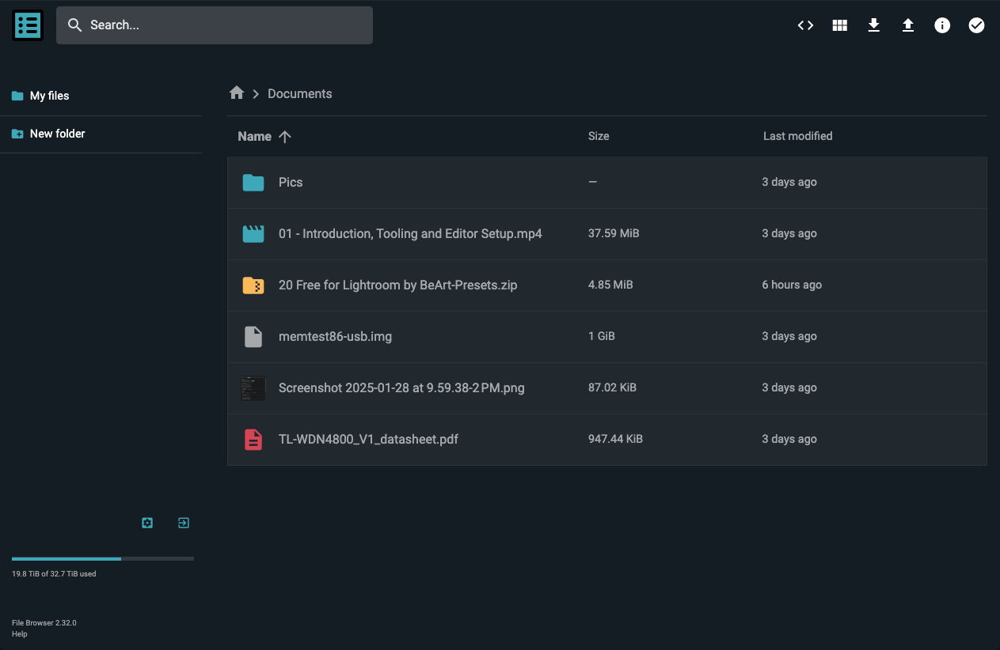

# Minimal Theme for FileBrowser

A lightly customized default theme for [FileBrowser](https://filebrowser.org/). This theme preserves the essence of the default FileBrowser UI while incorporating subtle improvements for better aesthetics and usability.

## Features

- **Updated FileBrowser Icon**: The main FileBrowser icon has been replaced with a new one from [SVG Repo](https://www.svgrepo.com/svg/467100/list-square) to make the application feel more modern.
- **Color Adjustments**: Several colors have been tweaked to improve contrast and consistency.
- **Side Nav Refinements**: Minor updates to side nav font sizes for a clearer visual hierarchy.
- **Minimalist Approach**: The theme remains as close as possible to the default FileBrowser style with only slight refinements.

## Screenshot

## Installation

1. Download the modified theme files.
2. Place files in `filebrowser/branding/` directory as [mentioned here](https://filebrowser.org/configuration/custom-branding) in the documentation.
3. Restart FileBrowser to apply changes.

## Acknowledgments

- The new icon used in this theme is sourced from [SVG Repo](https://www.svgrepo.com/svg/467100/list-square). Full credit to the original creator.

## License

This theme is released under the same license as FileBrowser. Refer to FileBrowser's licensing terms for more details.

---

Enjoy the refined look of FileBrowser with minimal changes!
